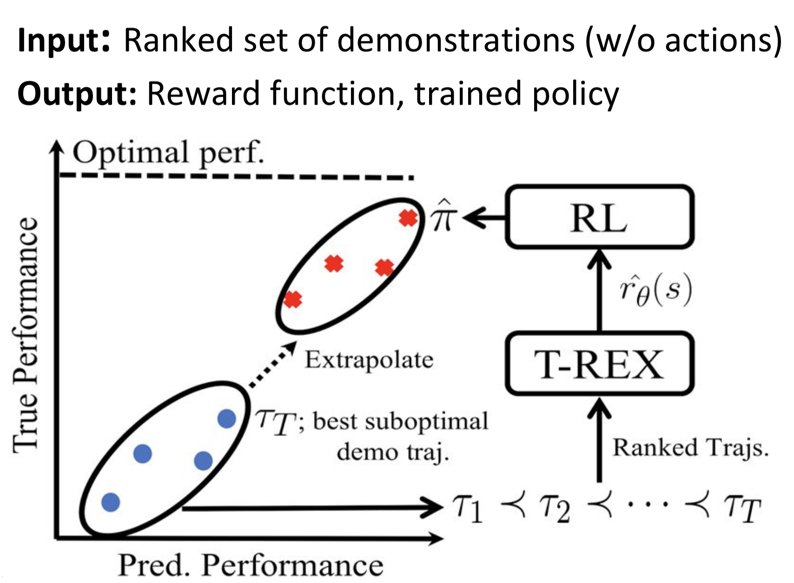
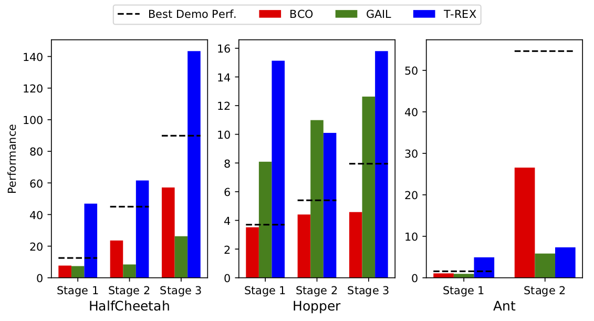
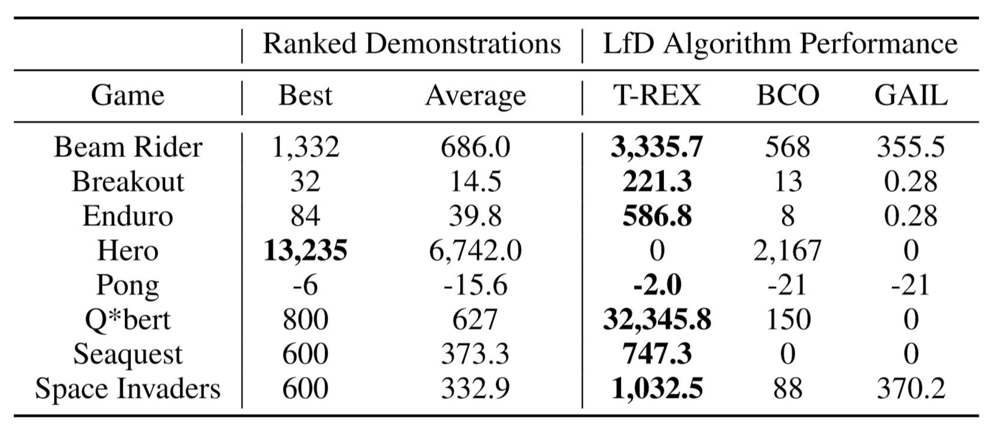
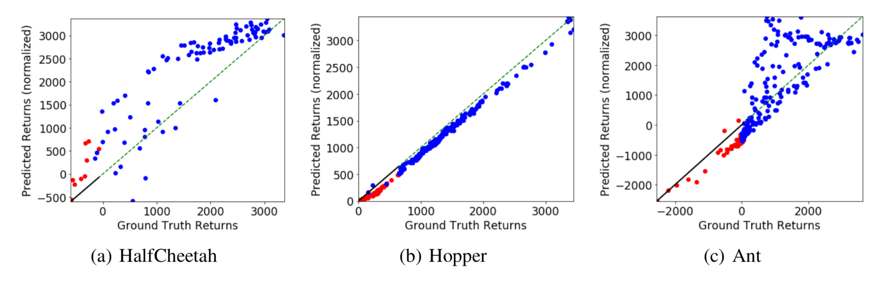
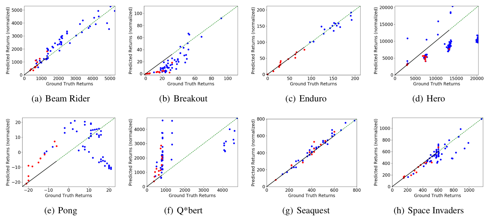
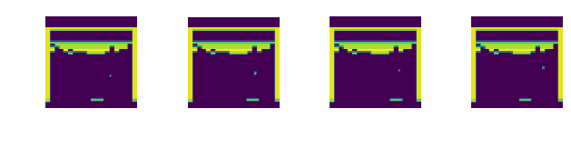
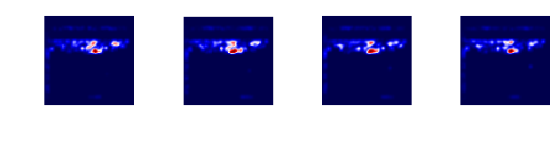
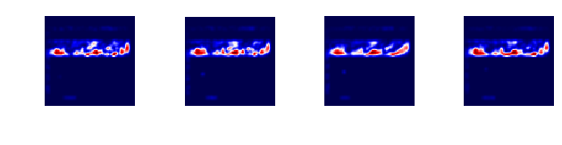
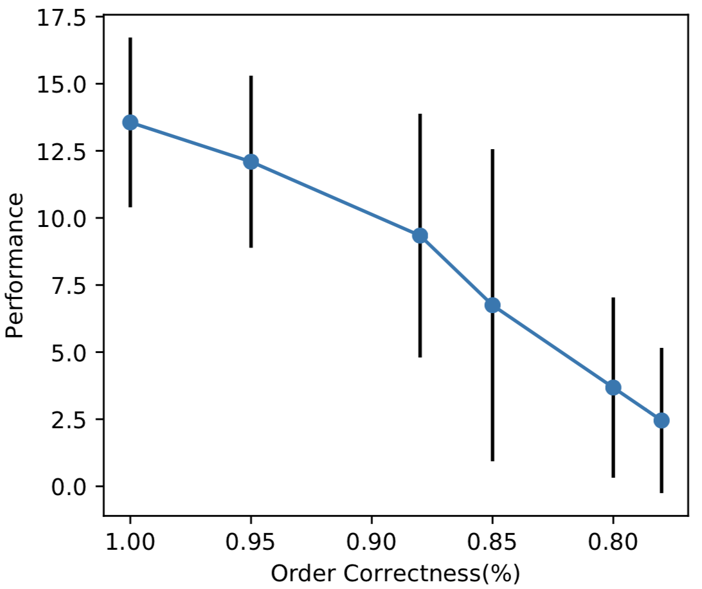

# Abstract

A critical flaw of existing inverse reinforcement learning (IRL) methods is their inability to significantly outperform the demonstrator.
This is because IRL typically seeks a reward function that makes the demonstrator appear near-optimal, rather than inferring the underlying intentions of the demonstrator that may have been poorly executed in practice.
In this paper, we introduce a novel reward-learning-from-observation algorithm, Trajectory-ranked Reward EXtrapolation (T-REX), that extrapolates beyond a set of (approximately) ranked demonstrations in order to infer high-quality reward functions from a set of potentially poor demonstrations. When combined with deep reinforcement learning, T-REX out-performs state-of-the-art imitation learning and IRL methods on multiple Atari and MuJoCo benchmark tasks, and can achieve performance that is sometimes more than an order of magnitude better than the best-performing demonstration.
Finally, we demonstrate that T-REX is robust to modest amounts of ranking noise and can accurately extrapolate intention by simply watching a learner noisily improve at a task over time.

# Motivation

> How can you efficiently learn a good control policy from suboptimal demonstrations?

Standard techniques in imitation learning such as behavior cloning are not well suited for learning from suboptimal demonstrations. Behavioral cloning aims to directly imitate the demonstrator's action for a given state, and most inverse reinforcement learning (IRL) techniques aim to learn reward functions (for subsequent use by RL algorithms) that make the demonstrator's performance appear optimal. We aim to find an approach that learns to successfully learn a reward function from a suboptimal demonstrator, allowing an agent to *outperform* the demonstrator given this reward function. The approach we take is to assume that we are given access to multiple suboptimal demonstrations, with a ranked ordering over the demonstrations, indicating which demonstrations perform better than others. This approach is appealing in a few ways.

First, consider the game of the Breakout, in which the agent must eliminate as many bricks as possible. Consider the following video frames:

  <video src="assets/paper/breakout_bestdemo.mp4" width="320" height="320" controls preload></video>

If the demonstrator achieved those given states, an IRL algorithm would try and make this frame optimal. That is, an IRL algorithm would aim to learn a reward function that makes knocking over "some" bricks optimal. What can result is semantically and qualitatively different behavior from what we desire, which is to knock over as many bricks as possible. In aiming to make the demonstrator appear optimal, traditional IRL fails to capture the *intent* of the demonstrator. When the inputs are ranked, this might be possible, since if a preferred trajectory eliminates more bricks than an inferior trajectory, a reward learner can learn to associate reward with eliminating bricks.

The other intuitive appeal of using ranked demonstrations to learn a reward as opposed to traditional IRL is to address the reward ambiguity problem. In traditional IRL, we aim to find a reward function that makes the demonstrations appear optimal. However, several reward functions may satisfy this objective. For example, a reward function that gives a reward of 0 in all scenarios technically makes the demonstrator's trajectory optimal. Such rewards functions can be eliminated by ranking.

# How does it work?

  
  
 Figure 1 - T-REX intuition

We convert the inverse reinforcement learning problem into binary classification problem. That is, we train a binary classifier that uses cumulative returns as logits to predict which of two demonstrations is higher ranked;

$$ \mathcal{L}(\theta) = -\sum_{\tau_i \prec \tau_j} \log \frac{\exp \displaystyle\sum_{s \in \tau_j} \hat{r}_\theta(s)}{\exp \displaystyle\sum_{s \in \tau_i} \hat{r}_\theta(s) + \exp \displaystyle\sum_{s \in \tau_j} \hat{r}_\theta(s)}.
$$

Then, we train a policy with an ordinary reinforcement learning algorithm on the learned reward function to get a better-than-demonstration policy.

Our formulation has several benefits: (1) it does not require any MDP solving or inference-time data collection, (2) it works well even without action labels, (3) works well with small numbers of demonstrations, and (4) it even scales well with high-dimensional tasks.

# Experimental Results

We conducted experiments with Mujoco locomotion tasks and Atari tasks. For the comprehensive details and results of our experiments, please refer the original paper or the provided code.

## Learned Policy Performance

> Can T-REX result in a better policy than given demonstrations while other IRL methods fail to do so?

  

    

      
      
(a) Mujoco Locomotion Tasks

    

    

      
      
(b) Atari Games

    

  

  
 Figure 2 - The learned policy performance given suboptimal demonstrations.

T-REX outperforms best given demonstrations in 7/8 scenarios in Mujoco and 7/8 games in Atari games while other state-of-the-art imitation learning methods, namely behavior cloning from observation (BCO) and generative adversarial imitation learning (GAIL) fail to do so. Here are few videos of best given demonstrations and rollout of T-REX policies.

  

    

      
 Demo 

      <video src="assets/paper/cheetah_120_demo_trimmed.mp4" width="320" height="320" controls preload></video>
    

    

    

      
 Policy Rollout 

      <video src="assets/paper/cheetah_120_trex_trimmed.mp4" width="320" height="320" controls preload></video>
    

  

  
 (a) Stage-3 HalfCheetah 

  

    

      <video src="assets/paper/breakout_bestdemo.mp4" width="320" height="320" controls preload></video>
    

    

    

      <video src="assets/paper/breakout_trex.mp4" width="320" height="320" controls preload></video>
    

  

  
 (b) Breakout 

  
Links for the other games 

  
(c) Enduro (<a href='assets/paper/enduro_bestdemo.mp4'>Best Demo</a>/<a href='assets/paper/enduro_trex.mp4'>T-REX</a>)

  
(d) Pong (<a href='assets/paper/pong_bestdemo.mp4'>Best Demo</a>/<a href='assets/paper/pong_trex.mp4'>T-REX</a>)

  
(e) Qbert (<a href='assets/paper/qbert_bestdemo.mp4'>Best Demo</a>/<a href='assets/paper/qbert_trex.mp4'>T-REX</a>)

  
(f) SpaceInvaders (<a href='assets/paper/spaceinvaders_bestdemo.mp4'>Best Demo</a>/<a href='assets/paper/spaceinvaders_trex.mp4'>T-REX</a>)

## Inferred Reward Functions

> Is the inferred reward-function really extrapolating?

We investigated the ability of T-REX accurately extrapolate beyond the demonstrator. To do so, we compared ground-truth return and T-REX inferred return across trajectories from a range of perfomance qualities, including trajectories much better than the best demonstration given to T-REX. The results are shown in Figure 3. We were able to observe more accurate extrapolating behavior for the scenarios in which outperforming given demonstrations is achieved.

  
  
 (a) Mujoco 

  
  
 (b) Atari 

  
 Figure 3 - Red points correspond to demonstrations and blue points correspond to trajectories not given as demonstrations. The solid line represents the performance range of the demonstrator, and the dashed line represents extrapolation beyond the demonstrator’s performance. The x-axis is the ground-truth return and the y-axis is the predicted return from our learned reward function. Predicted returns are normalized to have the same scale as the ground-truth returns.

> Does the inferred reward function contain semantically meaningful features?

To check whether semantically meaningful features, such as blocks in Breakout, are learned through our method, we generated attention maps for the learned rewards for the Atari domains. The results are shown in Figure 4. The reward function visualizations suggest that our networks are learning relevant features of the reward function.

  
  
  
 (a) Breakout observation and attention for the frames with maximum predicted reward 

  
  
  
 (b) Breakout observation and attention for the frames with minimum predicted reward

  
 Figure 4 - Maximum and minimum predicted observations and corresponding attention maps for Breakout. The observation with maximum predicted reward shows many of the bricks destroyed with the ball on its way to hit another brick. The network has learned to put most of the reward weight on the remaining bricks with some attention on the ball and paddle. The observation with minimum predicted reward is an observation where none of the bricks have been destroyed. The network attention is focused on the bottom layers of bricks. 

## Robustness to Ranking Noise

> Can T-REX work in the presence of ranking noise?

All the merits of T-REX rely on the external information of rankings, but we assumed the ground-truth ranking for the experiments presented thus far. To explore the effects of noisy rankings, we first examined the stage-1 Hopper task by generating a different-level of ranking noise and measuring the performance of T-REX for each level. Speficially, we synthetically generated ranking noise by starting with a list of trajectories sorted by ground-truth returns and randomly swapping adjacent trajectories. By varying the number of swaps, we were able to generate different noise levels, and the total-order correctness is used as a measure of noise level. The results is shown in Figure 5. We found that T-REX is relatively robust to noise of up to around 15% pairwise errors.

  
  
 Figure 5 - The performance of T-REX for different amounts of pairwise ranking noise in the Hopper domain. T-REX shows graceful degradation as ranking noise increases. The graph shows the mean across 9 trials and 95% confidence interval.

> How about human-generated noisy rankings?

We further tested our algorithm in the most realistic setting in which the ranking is generated by a human for Atari games. We used Amazon Mechanical Turk to collect human rankings; We presented videos of the demonstrations in pairs along with a brief text description of the goal of the game and asked workers to select which demonstration had better performance, with an option for selecting "Not Sure". We collected six labels per demonstration pair and used the most-common label as the label for training the reward function. The results is shown in Figure 6. We found that despite this preprocessing step, human labels added a significant amount of noise and resulted in pair-wise rankings with accuracy between 63% and 88% when compared to ground-truth labels. However, despite significant ranking noise, T-REX outperformed the demonstrator on 5 of the 8 Atari games.

  
  
 Figure 6 - Evaluation of T-REX on human rankings collected using Amazon Mechanical Turk. Results are the best average performance over 3 random seeds with 30 trials per seed. 

